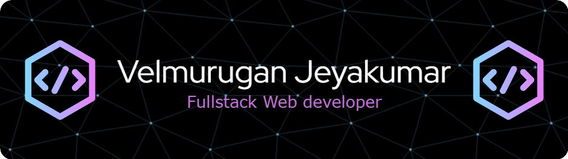

<h1> Hey! Nice to see you.</h1>

Welcome to my page!  <b>I'm Velmurugan</b>, aspiring Fullstack Web developer from  <b>Chennai, India</b>

<!--  -->

<h3> Things i code with ! </h3>
  

<!-- <h3> Pinned Repositories </h3>

  
 -->
<!--   

  
  
  
 -->

<h3> Currently playing song </h3>

<h3>Where to find me</h3>

  
  
   
      
    
      
      

  

 

<!--  -->

