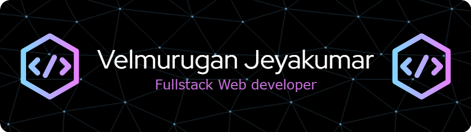

## Hey, I'm Velmurugan 👋

I'm Velmurugan (Velan), a full‑stack / cloud‑native developer from Chennai, India.  
I enjoy building web apps end‑to‑end - from APIs and data models to clean, usable UIs.

- Software Development Engineer I @ Rootquotient  
- B.E. Computer Science, College of Engineering, Guindy (Anna University)  
- Mostly working with Node.js, React, serverless, and AWS

---

## 🌐 Portfolio

If you want the full story (case studies, timeline, skills, blogs), it’s all here:

👉 **https://velan.site**

---

## 🔧 Tech I use a lot

  

I also work with things like Redis, Laravel, Docker, Nginx, and various AWS services
whenever the project needs them.

---

## 📌 What I'm doing these days

- Building and maintaining production apps at work  
- Playing with serverless patterns on AWS  
- Writing about performance, reliability, and “real-world” trade‑offs  
- Slowly grinding through LeetCode to keep problem‑solving sharp  

---

## ⭐ Featured projects

Some repos I like to point people to:

  
  

  
  

You’ll find more projects (with live links) on **https://velan.site**.

---

## 📈 GitHub overview

If these cards ever fail to load, you can just comment them out.

  
  

---

## ✍️ Things I write

I like writing about the stuff I actually use at work:

- [Lambda Cold Starts Demystified](https://velanj.medium.com/lambda-cold-starts-demystified-with-vpc-provisioned-concurrency-and-practical-insights-4b9576ddf711)  
- [What Actually Is AWS Lambda?](https://velanj.medium.com/what-actually-is-aws-lambda-and-why-is-everyone-obsessed-with-serverless-7e9b4e7e9a0e)  
- [Salesforce, SOQL, and Faster Client Portals](https://velanj.medium.com/salesforce-soql-and-how-we-made-our-client-portal-faster-26ba8196da61)  

More here: **https://velanj.medium.com**

---

## 🎯 Coding profiles

  

---

## 👋 Outside of code

- Cricket fan (especially Test cricket + Virat Kohli)  
- Big on MCU, Modern Family, and movie soundtracks  
- Certified cat person — hanging out with Ronaldo whenever I can  

---

## 🌎 Find me

  
  
  
  

